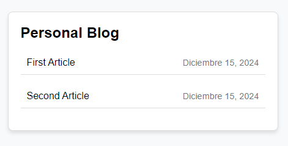
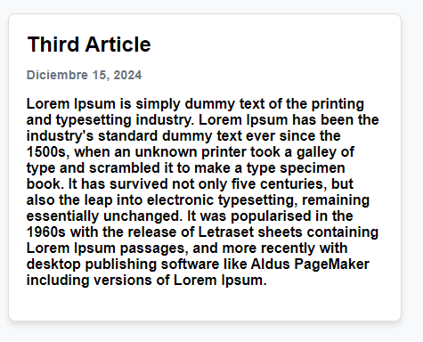
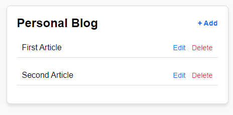
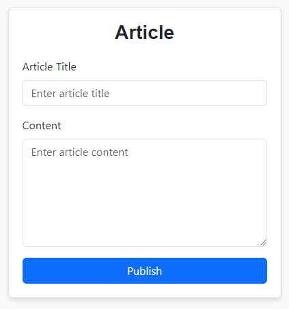
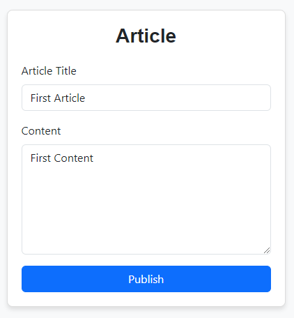

# Personal Blog with Spring MVC and Thymeleaf

This project is a personal blog application built using Spring MVC and Thymeleaf. It features a guest section for viewing articles and an admin section for managing blog content.

## Features

### Guest Section
1. **Home Page**: Displays a list of published articles.
2. **Article Page**: Shows the content of an article along with its publication date.

### Admin Section
1. **Dashboard**:
    - Displays a list of published articles.
    - Allows adding, editing, and deleting articles.
2. **Add Article Page**: Provides a form to add a new article with fields for the title, content, and publication date.
3. **Edit Article Page**: Provides a form to edit an existing article with fields for the title, content, and publication date.

## Technologies Used
- **Java**: Core programming language.
- **Spring Framework**: Used for MVC architecture and backend logic.
- **Thymeleaf**: Template engine for rendering the frontend.
- **MySQL**: Database to store articles.
- **HTML, CSS, JavaScript**: For the frontend design and interactivity.

## Getting Started

### Prerequisites
- Java Development Kit (JDK 17 or later)
- Maven
- MySQL Database

### Setup Instructions
1. Clone the repository:
   ```bash
   git clone https://github.com/ErickBrayan/Personal-Blog.git
   cd Personal-Blog
   ```
2. Configure the database:
    - Create a MySQL database named `blog`.
    - Update the `application.properties` file with your database credentials:
      ```properties
      spring.datasource.url=jdbc:mysql://localhost:3306/blog
      spring.datasource.username=your_username
      spring.datasource.password=your_password
      spring.jpa.hibernate.ddl-auto=update
      ```
3. Build the project:
   ```bash
   mvn clean install
   ```
4. Run the application:
   ```bash
   mvn spring-boot:run
   ```
5. Access the application:
    - Guest section: [http://localhost:8080/home](http://localhost:8080/home)
    - Admin section: [http://localhost:8080/admin](http://localhost:8080/admin)

## Usage

### Guest Section
- Navigate to the home page to see all articles.
- Click on an article title to view its details.

#### Screenshot



### Admin Section
- Log in to access the dashboard. (Test Credential: USER: admin, PASSWORD: admin)
- Add, edit, or delete articles as needed.


#### Screenshot





https://roadmap.sh/projects/personal-blog 
